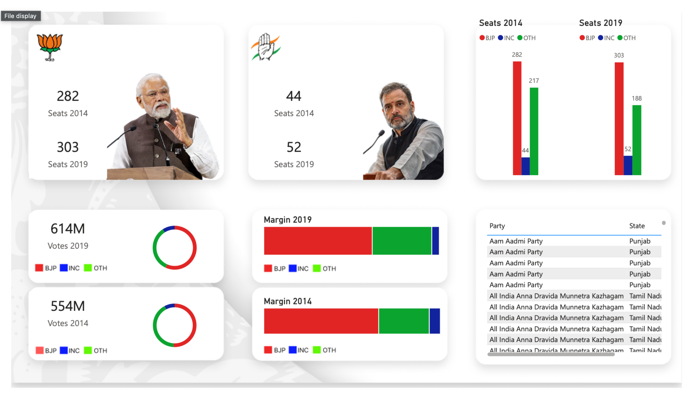

# India-Election-Analysis-PowerBI

This project provides a comprehensive visual analysis of the **Indian General Elections (2014-2019)**. By leveraging Power BI's advanced data modeling and visualization capabilities, it transforms raw election data into actionable insights, highlighting significant shifts in the democratic landscape of India.

---

## 📊 Project Overview
The analysis focuses on the transition between the 16th and 17th Lok Sabha, capturing the dramatic changes in seat shares and voter engagement.

* **Seat Shifts**: Detailed visualization of the **BJP's growth from 282 to 303 seats** and the **INC's change from 44 to 52 seats**.
* **Voter Growth**: Tracking the increase in voter turnout from **554 million to 614 million**.
* **Democratic Trends**: A deep dive into regional performance, winning margins, and party-wise vote shares across different states.

---

## 🛠️ Tech Stack & Tools
* **Power BI**: For building interactive dashboards and data storytelling.
* **Power Query**: Used for data cleaning, transformation, and shaping (ETL).
* **DAX (Data Analysis Expressions)**: Utilized to create complex calculated columns and measures for precise analytical insights.

---

## 📂 Repository Structure
* **`Elections.pbix`**: The core Power BI project file containing the data model and visualizations.
* **`Elections.pdf`**: A static export of the dashboard for quick viewing.
* **`Election-Dashboard-Pic.png`**: A preview image of the main dashboard interface.
* **`Source/`**: Contains the raw datasets used for the analysis.
* **`Images/`**: Additional screenshots and assets for documentation.

---

## 🚀 Key Insights
* **Party Dominance**: Analysis of the landslide victory and the consolidation of power in specific regions.
* **Voter Participation**: Correlation between increased voter turnout and final results.
* **Swing Seats**: Identification of constituencies that experienced a change in party leadership between 2014 and 2019.

---

## 📥 How to Use
1. Clone this repository to your local machine.
2. Ensure you have **Power BI Desktop** installed.
3. Open `Elections.pbix` to interact with the filters and drill down into specific state-level data.
